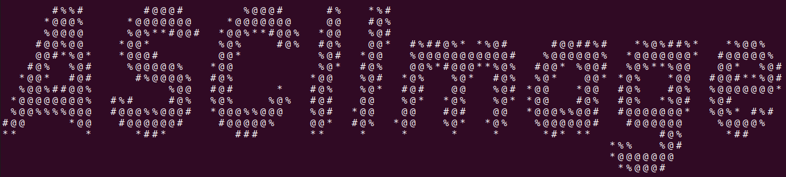

<div align="center">
  <a href="https://youtu.be/dQw4w9WgXcQ?si=ML2wpxiv7NDnEIQt">
    
  </a>
</div>

# Presentation

**ASCIImage** is a tool that allows you to create ASCII art videos from any videos. With a simple YouTube video, you can generate ASCII art that can be displayed directly in your terminal

# Installation

1. Clone this repository and navigate to its root directory

```bash
git clone https://github.com/guillermfr/ASCIImage.git
cd ASCIImage
```

2. Install necessary packages

```bash
sudo apt update
sudo apt install yt-dlp ffmpeg imagemagick build-essential
```

# How to use ASCIImage ?

1. Navigate to the root of the project

```bash
cd ASCIImage
```

2. Convert your YouTube video to text files that will later be displayed by the script

```bash
bash ./script.sh <YouTube URL>
```

Replace `<YouTube URL>` with the link to the YouTube video you want to convert.

3. Open a terminal and set it to fullscreen

4. (Optional but recommanded) Adjust your terminal preferences for better display:

    * In your terminal preferences, create a profile with **1.40 width cell spacing** for optimal ASCII art rendering.

5. Display your ASCII art and enjoy !

```bash
bash ./display.sh
```

# Example

Here’s an example of how to use ASCIImage:

```bash
bash ./script.sh https://www.youtube.com/watch?v=dQw4w9WgXcQ
# Wait for the process to finish
bash ./display.sh
```

This will download the video, convert it into ASCII art, and display it in your terminal.

# Notes

* The script generates temporary files in the `data/` directory. You can clean up this directory manually if needed.